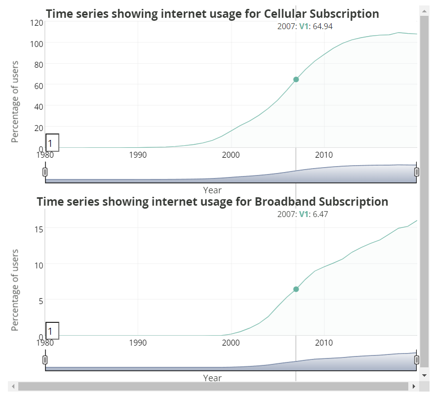
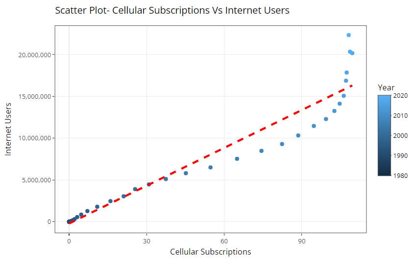
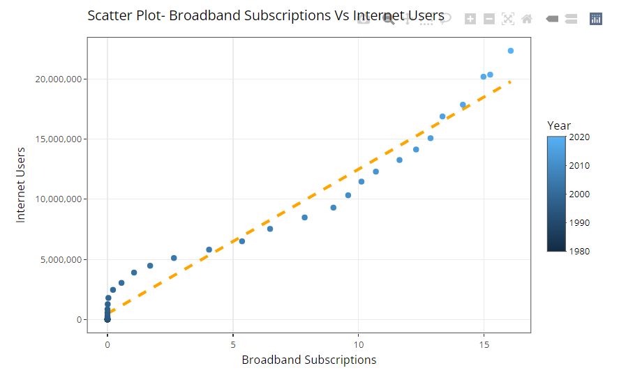
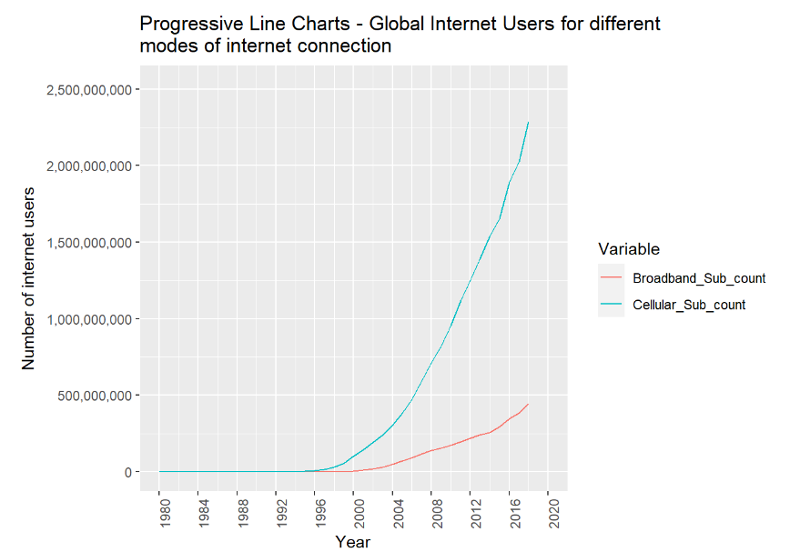
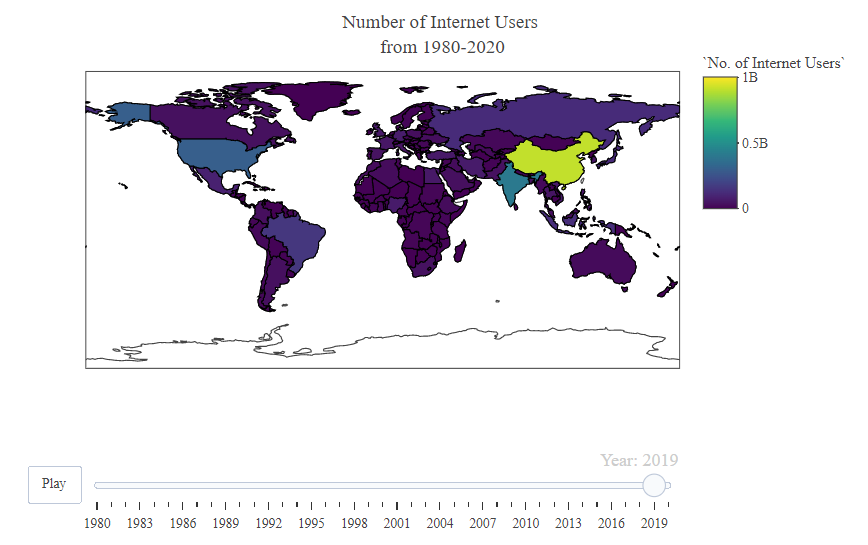
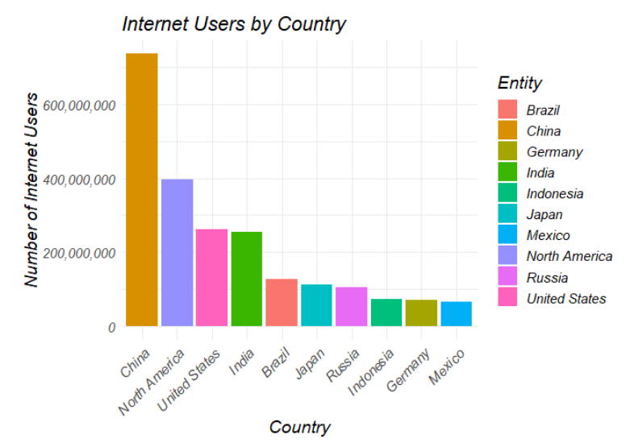

I have used RStudio to work on this project. 

The dataset consists of country-wise internet users from 1980 to 2020. Each row in the dataset represents- for a particular country and an year, the mobile phone subscription per 100 people along with percentage of internet users using the internet, number of people using the internet and number of fixed broadband subscriptions per 100 people.

As part of this project, I am investigating the following questions and I have depicted the respective visualizations based on the available data:

1. How the general trends of internet usage(via mobile phone and broadband subscriptions) has been over the years from 1980 to 1920 for the countries? Are we observing a general pattern of user growth based on the telecommunication mode?

Visualization - 

2. What does the relationship between the mobile phone subscriptions and internet users looks like over the years? Are they strongly correlated to each other? Does increase in mobile phone subscriptions has an effect on the usage of the internet?

Visualization - 

3. Similarly what does the relationship between the fixed broadband subscriptions and internet users looks like over the years? Are they strongly correlated to each other? Does increase in fixed broadband subscriptions has an effect on the usage of the internet?

Visualization - 

Visualization - 

4. What is the average number of people using different modes of internet connections and how is it varying from 1980 to 2020?

Visualization - 

5. Which countries has the most number of internet users in the last 10 years? How much percentage population of internet users are being occupied by the top 10 countries?

Visualization - 

I have provided additional visualizations as well as part of the project to understand the trends of internet usage across the world in the past four decades. 

Dataset link: https://www.kaggle.com/datasets/ashishraut64/internet-users

